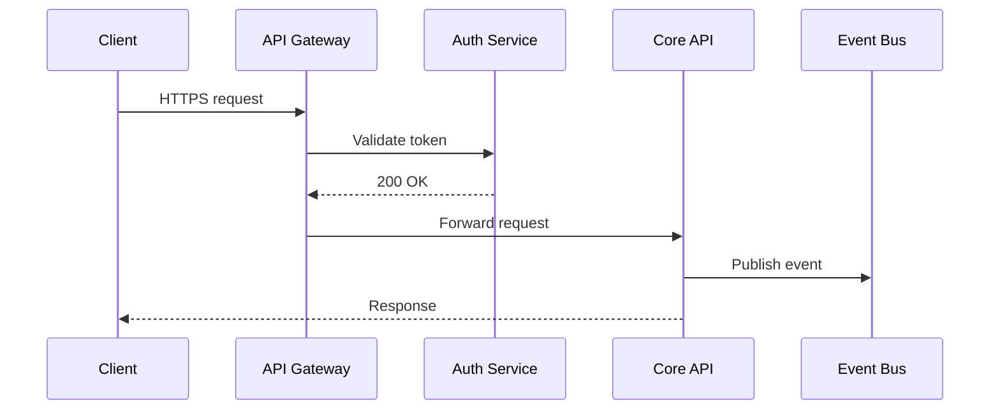
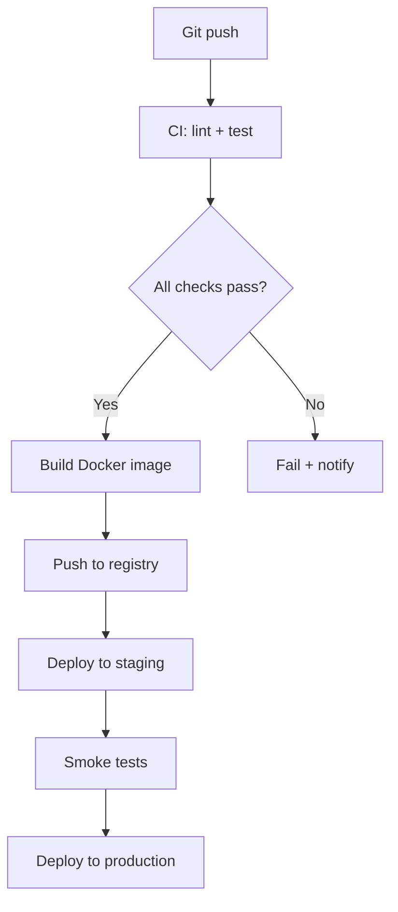

# Q3 Product Roadmap Review

### Engineering · Design · Product

  Presented by the Platform Team — September 2025

<!--
Welcome everyone. Today we'll walk through what we set out to do in Q3,
what we delivered, and what's coming up in Q4.
-->

---

# What We Set Out to Do

Key objectives entering Q3:

<v-clicks>

- Migrate the data pipeline to the new event-streaming architecture
- Reduce p95 API latency below 200 ms across all regions
- Ship the redesigned onboarding flow to 100% of new users
- Establish a quarterly review cadence across all squads
- Deprecate three legacy endpoints before the hard cutoff date

</v-clicks>

<!--
These five objectives were agreed upon in the Q2 retro and signed off by all team leads.
We'll measure success against each one.
-->

---

  [ Roadmap overview — add image to public/assets/roadmap-overview.png ]

<!--
This is an overview of the full Q3 roadmap as it looked on day 1.
Each swim lane represents a squad.
-->

---
layout: two-cols
---

<template v-slot:default>

## Architecture Before

  [ Architecture diagram — add image to public/assets/arch-before.png ]

</template>
<template v-slot:right>

## What Changed

- Monolithic job runner replaced with distributed workers
- Shared PostgreSQL cluster split per domain
- All internal traffic moved to gRPC
- Secrets management migrated to Vault

</template>

<!--
The left shows the legacy monolith. The four bullet points on the right are
the concrete changes we shipped in the first six weeks.
-->

---
layout: two-cols
---

<template v-slot:default>

## Team Allocation

We restructured squads at the start of Q3 to better align with product areas.

- **Platform** — 4 engineers, 1 EM
- **Growth** — 3 engineers, 1 designer
- **Core API** — 5 engineers, 1 EM
- **Data** — 2 engineers, 1 data scientist

</template>
<template v-slot:right>

  [ Team structure diagram — add image to public/assets/team-structure.png ]

</template>

<!--
Headcount stayed the same but squad boundaries shifted significantly.
The Growth squad gained a dedicated designer for the first time.
-->

---
layout: two-cols
---

<template v-slot:default>

## Shipped on Time

<v-clicks>

- Event streaming backbone
- Onboarding redesign (v1)
- Auth service consolidation
- Dashboard performance pass

</v-clicks>

</template>
<template v-slot:right>

## Slipped to Q4

<v-clicks>

- Self-serve billing portal
- Multi-region failover
- SDK v3 public release
- Admin audit log export

</v-clicks>

</template>

<!--
Four out of eight major initiatives shipped on time. The slips were
mostly caused by cross-team dependency delays, not scope creep.
-->

---

# Q3 Outcomes at a Glance

  
↓ 38%

  
Reduction in p95 API latency

  
12 / 15

  
Planned features delivered

  
99.94%

  
Uptime across all services

  
+22 NPS

  
Developer satisfaction score

<!--
Latency target was 200 ms — we hit 185 ms p95. The NPS jump of 22 points
was the most surprising result; the new onboarding flow drove most of that.
-->

---

# Retrospective Notes

Per-squad retrospective collected after the quarter closed. Available in the exported PDF for async review.

- **Platform:** appreciated the clearer RFC process; wants shorter on-call rotations
- **Growth:** onboarding iteration cycle too slow; needs a dedicated staging environment
- **Core API:** strong delivery quarter; blocked occasionally by cross-team dependencies
- **Data:** undersized for scope; Q4 headcount request submitted and approved

<!--
This slide is intentionally not presented during the live session.
It exists for stakeholders reviewing the deck asynchronously.
-->

---
layout: default
---

# System Interaction Model

How requests flow through the updated stack:

**Request path**

**Deployment pipeline**

<!--
Left diagram shows the happy-path request flow. Right diagram is the
deployment pipeline — smoke tests gate every production deploy.
-->

---

# Q4 Focus Areas

### Reliability

- Multi-region active-active
- Chaos engineering programme
- Automated rollback triggers

### Product

- Self-serve billing portal
- SDK v3 GA release
- Admin audit log export
- In-app notification centre

### Developer Experience

- Unified local dev setup
- Internal API documentation portal
- Dependency upgrade automation

<!--
Reliability is the top priority given the multi-region slip from Q3.
DX investments are small but high-impact for team velocity.
-->

---
class: text-center
---

# Thank You

Questions and discussion welcome.

  Slides available at <code>github.com/your-org/slidev-max</code>

<!--
Leave 10 minutes for questions. The full deck including retrospective
notes will be shared in the team channel after this session.
-->
